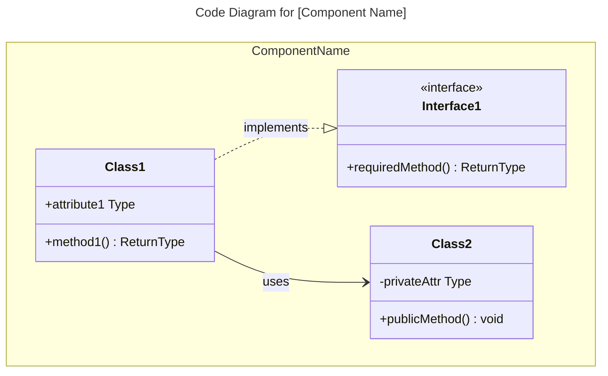
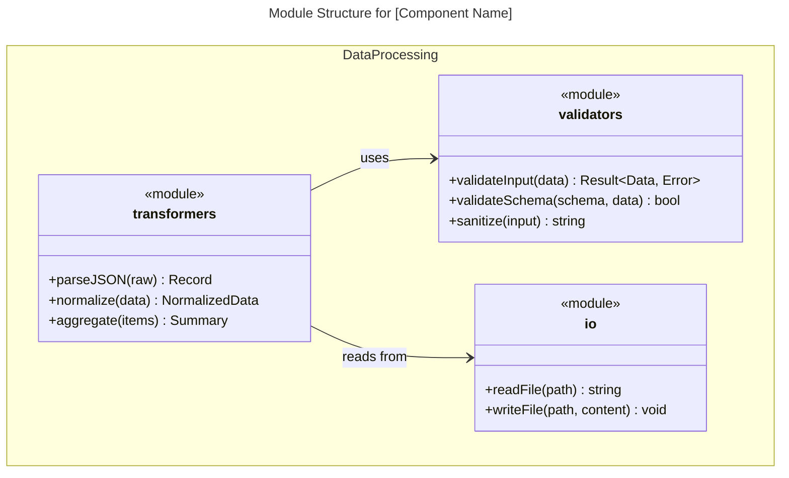
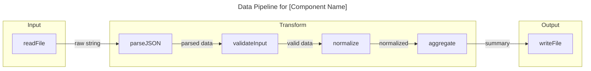
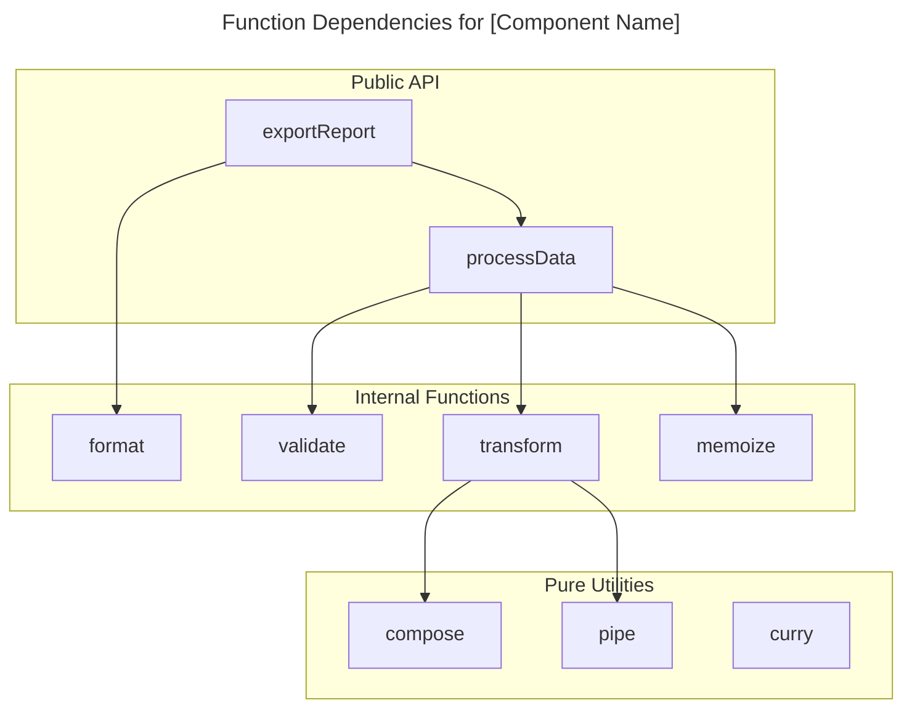

# C4 Code Level: [Directory Name]

## Use this skill when

- Working on c4 code level: [directory name] tasks or workflows
- Needing guidance, best practices, or checklists for c4 code level: [directory name]

## Do not use this skill when

- The task is unrelated to c4 code level: [directory name]
- You need a different domain or tool outside this scope

## Instructions

- Clarify goals, constraints, and required inputs.
- Apply relevant best practices and validate outcomes.
- Provide actionable steps and verification.
- If detailed examples are required, open `resources/implementation-playbook.md`.

## Overview

- **Name**: [Descriptive name for this code directory]
- **Description**: [Short description of what this code does]
- **Location**: [Link to actual directory path]
- **Language**: [Primary programming language(s)]
- **Purpose**: [What this code accomplishes]

## Code Elements

### Functions/Methods

- `functionName(param1: Type, param2: Type): ReturnType`
  - Description: [What this function does]
  - Location: [file path:line number]
  - Dependencies: [what this function depends on]

### Classes/Modules

- `ClassName`
  - Description: [What this class does]
  - Location: [file path]
  - Methods: [list of methods]
  - Dependencies: [what this class depends on]

## Dependencies

### Internal Dependencies

- [List of internal code dependencies]

### External Dependencies

- [List of external libraries, frameworks, services]

## Relationships

Optional Mermaid diagrams for complex code structures. Choose the diagram type based on the programming paradigm. Code diagrams show the **internal structure of a single component**.

### Object-Oriented Code (Classes, Interfaces)

Use `classDiagram` for OOP code with classes, interfaces, and inheritance:


````

### Functional/Procedural Code (Modules, Functions)

For functional or procedural code, you have two options:

**Option A: Module Structure Diagram** - Use `classDiagram` to show modules and their exported functions:



**Option B: Data Flow Diagram** - Use `flowchart` to show function pipelines and data transformations:



**Option C: Function Dependency Graph** - Use `flowchart` to show which functions call which:



### Choosing the Right Diagram

| Code Style                       | Primary Diagram                  | When to Use                                             |
| -------------------------------- | -------------------------------- | ------------------------------------------------------- |
| OOP (classes, interfaces)        | `classDiagram`                   | Show inheritance, composition, interface implementation |
| FP (pure functions, pipelines)   | `flowchart`                      | Show data transformations and function composition      |
| FP (modules with ex
