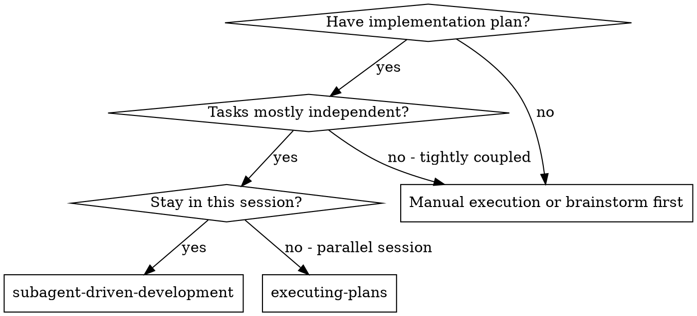

# Subagent-Driven Development

Execute plan by dispatching a fresh implementer subagent per task, a task review (spec compliance + code quality) after each, and a broad whole-branch review at the end.

**Why subagents:** You delegate tasks to specialized agents with isolated context. By precisely crafting their instructions and context, you ensure they stay focused and succeed at their task. They should never inherit your session's context or history — you construct exactly what they need. This also preserves your own context for coordination work.

**Core principle:** Fresh subagent per task + task review (spec + quality) + broad final review = high quality, fast iteration

**Narration:** between tool calls, narrate at most one short line — the
ledger and the tool results carry the record.

**Continuous execution:** Do not pause to check in with your human partner between tasks. Execute all tasks from the plan without stopping. The only reasons to stop are: BLOCKED status you cannot resolve, ambiguity that genuinely prevents progress, or all tasks complete. "Should I continue?" prompts and progress summaries waste their time — they asked you to execute the plan, so execute it.

## When to Use



**vs. Executing Plans (parallel session):**
- Same session (no context switch)
- Fresh subagent per task (no context pollution)
- Review after each task (spec compliance + code quality), broad review at the end
- Faster iteration (no human-in-loop between tasks)

## The Process

```dot
digraph process {
    rankdir=TB;

    subgraph cluster_per_task {
        label="Per Task";
        "Dispatch implementer subagent (./implementer-prompt.md)" [shape=box];
        "Implementer subagent asks questions?" [shape=diamond];
        "Answer questions, provide context" [shape=box];
        "Implementer subagent implements, tests, commits, self-reviews" [shape=box];
        "Write diff file, dispatch task reviewer subagent (./task-reviewer-prompt.md)" [shape=box];
        "Task reviewer reports spec ✅ and quality approved?" [shape=diamond];
        "Dispatch fix subagent for Critical/Important findings" [shape=box];
        "Mark task complete in todo list and progress ledger" [shape=box];
    }

    "Read plan, note context and global constraints, create todos" [shape=box];
    "More tasks remain?" [shape=diamond];
    "Dispatch final code reviewer subagent (../requesting-code-review/code-reviewer.md)" [shape=box];
    "Use superpowers:finishing-a-development-branch" [shape=box style=filled fillcolor=lightgreen];

    "Read plan, note context and global constraints, create todos" -> "Dispatch implementer subagent (./implementer-prompt.md)";
    "Dispatch implementer subagent (./implementer-prompt.md)" -> "Implementer subagent asks questions?";
    "Implementer subagent asks questions?" -> "Answer questions, provide context" [label="yes"];
    "Answer questions, provide context" -> "Dispatch implementer subagent (./implementer-prompt.md)";
    "Implementer subagent asks questions?" -> "Implementer subagent implements, tests, commits, self-reviews" [label="no"];
    "Implementer subagent implements, tests, commits, self-reviews" -> "Write diff file, dispatch task reviewer subagent (./task-reviewer-prompt.md)";
    "Write diff file, dispatch task reviewer subagent (./task-reviewer-prompt.md)" -> "Task reviewer reports spec ✅ and quality approved?";
    "Task reviewer reports spec ✅ and quality approved?" -> "Dispatch fix subagent for Critical/Important findings" [label="no"];
    "Dispatch fix subagent for Critical/Important findings" -> "Write diff file, dispatch task reviewer subagent (./task-reviewer-prompt.md)" [label="re-review"];
    "Task reviewer reports spec ✅ and quality approved?" -> "Mark task complete in todo list and progress ledger" [label="yes"];
    "Mark task complete in todo list and progress ledger" -> "More tasks remain?";
    "More tasks remain?" -> "Dispatch implementer subagent (./implementer-prompt.md)" [label="yes"];
    "More tasks remain?" -> "Dispatch final code reviewer subagent (../requesting-code-review/code-reviewer.md)" [label="no"];
    "Dispatch final code reviewer subagent (../requesti
