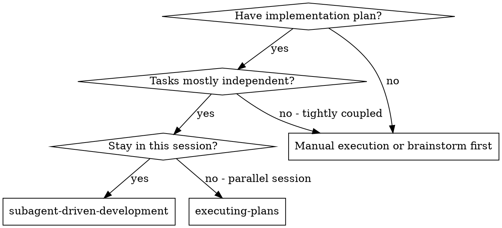

# Subagent-Driven Development

Execute plan by dispatching a fresh implementer subagent per task, a task review (spec compliance + code quality) after each, and a broad whole-branch review at the end.

**Why subagents:** You delegate tasks to specialized agents with isolated context. By precisely crafting their instructions and context, you ensure they stay focused and succeed at their task. They should never inherit your session's context or history — you construct exactly what they need. This also preserves your own context for coordination work.

**Core principle:** Fresh subagent per task + task review (spec + quality) + broad final review = high quality, fast iteration

**Narration:** between tool calls, narrate at most one short line — the
ledger and the tool results carry the record.

**Continuous execution:** Do not pause to check in with your human partner between tasks. Execute all tasks from the plan without stopping. The only reasons to stop are: BLOCKED status you cannot resolve, ambiguity that genuinely prevents progress, or all tasks complete. "Should I continue?" prompts and progress summaries waste their time — they asked you to execute the plan, so execute it.

## When to Use



**vs. Executing Plans (parallel session):**
- Same session (no context switch)
- Fresh subagent per task (no context pollution)
- Review after each task (spec compliance + code quality), broad review at the end
- Faster iteration (no human-in-loop between tasks)

## The Process

```dot
digraph process {
    rankdir=TB;

    subgraph cluster_per_task {
        label="Per Task";
        "Dispatch implementer subagent (./implementer-prompt.md)" [shape=box];
        "Implementer asks questions?" [shape=diamond];
        "Answer questions, provide context" [shape=box];
        "Implementer implements, tests, commits, self-reviews" [shape=box];
        "Generate review package, dispatch task reviewer (./task-reviewer-prompt.md)" [shape=box];
        "Spec ✅ and quality approved?" [shape=diamond];
        "Finding conflicts with plan text?" [shape=diamond];
        "Ask human partner which governs" [shape=box];
        "Fix round R of 5: R≤3 resume implementer; R≥4 fresh implementer, more capable model" [shape=box];
        "Dispatch scoped re-review (./re-review-prompt.md)" [shape=box];
        "All findings addressed?" [shape=diamond];
        "R = 5?" [shape=diamond];
        "Adjudicate each open finding" [shape=box];
        "Any load-bearing finding?" [shape=diamond];
        "STOP: report BLOCKED to human partner" [shape=box];
        "Park findings in ledger with rulings" [shape=box];
        "Append completion to ledger, mark todo complete" [shape=box];
    }

    "Setup: worktree, ledger check, read plan, pre-flight review" [shape=box];
    "More tasks remain?" [shape=diamond];
    "Dispatch final code reviewer (../requesting-code-review/code-reviewer.md)" [shape=box];
    "Final findings? ONE fix dispatch, one scoped re-review, adjudicate residuals" [shape=box];
    "Final review clean: delete this plan's workspace" [shape=box];
    "Use superpowers:finishing-a-development-branch" [shape=box style=filled fillcolor=lightgreen];

    "Setup: worktree, ledger check, read plan, pre-flight review" -> "Dispatch implementer subagent (./implementer-prompt.md)";
    "Dispatch implementer subagent (./implementer-prompt.md)" -> "Implementer asks questions?";
    "Implementer asks questions?" -> "Answer questions, provide context" [label="yes"];
    "Answer questions, provide context" -> "Implementer implements, tests, commits, self-reviews";
    "Implementer asks questions?" -> "Implementer implements, tests, commits, self-reviews" [label="no"];
    "Implementer implements, tests, commits, self-reviews" -> "Generate review package, dispatch task reviewer (./task-reviewer-prompt.md)";
    "Generate review package, dispatch task reviewer (./task-reviewer-prompt.md)" -> "Spec ✅ and quality approved?";
    "Spec ✅ and quality approved?" -> "Append completion to ledger, mark todo complete" [label="yes"];
    "Spec ✅ and quality approved?" -> "Finding conflicts with plan text?" [label="no"];
    "Finding conflicts with pla
